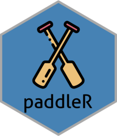

<!-- README.md is generated from README.Rmd. Please edit that file -->

```{r, include = FALSE}
knitr::opts_chunk$set(
  collapse = TRUE,
  comment = "#>",
  fig.path = "man/figures/README-",
  out.width = "100%"
)
```

# paddleR

<!-- badges: start -->
[](https://github.com/Arnold-Kakas/paddleR/actions/workflows/R-CMD-check.yaml)
[](https://app.codecov.io/gh/Arnold-Kakas/paddleR)
<!-- badges: end -->


## 📦 About paddleR



The goal of paddleR is to provide a comprehensive and user-friendly R interface to the Paddle API, enabling seamless integration with Paddle’s powerful billing and subscription management platform.

This R package provides a robust interface to the Paddle API, enabling developers, analysts, and product teams to interact with Paddle's billing and subscription platform directly from R.

The package allows you to:

* Create, retrieve, and update customers
* Generate authentication tokens for Paddle.js checkout flows
* Query customer lists with filters and pagination
* Retrieve subscription details, including status and history
* Manage products
* Manage invoices
* Many more

## Installation

You can install the development version of paddleR from [GitHub](https://github.com/) or stable version from CRAN with:
      
```{r}
#| eval = FALSE
# install development version from GitHub
# devtools::install_github("Arnold-Kakas/paddleR")

install.packages("paddleR")

library(paddleR)
```

## Modes

The package supports two modes of operation:

* Live mode (default): connects to the production Paddle API
* Sandbox mode: connects to the Paddle sandbox environment for testing

You can toggle modes using:

```{r}
#| eval = FALSE
set_paddle_mode("sandbox")  # or "live"
```

All API endpoints automatically adjust their base URL and authentication based on the selected mode.

## 🔐 API Key Configuration

To authenticate with the Paddle API, you must set your API key(s) as environment variables. You have two options:

### Option 1: Use a single key

Set PADDLE_KEY to the appropriate key for your current mode.

```{r}
#| eval = FALSE
Sys.setenv(PADDLE_KEY = "your-live-or-sandbox-key") # or use .Renviron file
```

## Option 2 (Recommended): Use separate keys for live and sandbox

Set both PADDLE_KEY_LIVE and PADDLE_KEY_SANDBOX, and the package will automatically use the correct one based on the selected mode.

```{r}
#| eval = FALSE
Sys.setenv(PADDLE_KEY_LIVE = "your-live-key")
Sys.setenv(PADDLE_KEY_SANDBOX = "your-sandbox-key")
```

API keys must have the appropriate permissions based on the Paddle endpoint you are accessing. Refer to the official [Paddle API docs](https://developer.paddle.com/api-reference/overview) for required scopes.

## API coverage

The package currently supports the following Paddle API endpoint categories:

- Customers
- Products
- Subscriptions
- Invoices
- Events

Missing an endpoint? Please open an issue on GitHub or submit a pull request. At this moment there are several endpoint categories that are not yet implemented, including:

- Notifications
- Notification Settings
- Adjustments
- Few endpoints from higher mentioned categories
